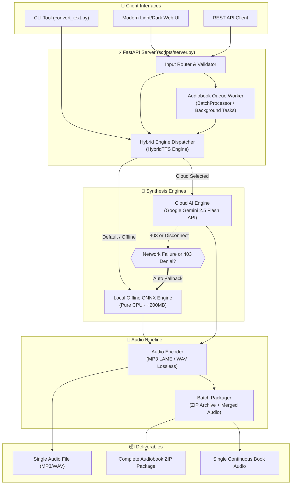

<div align="center">

<picture>
  <source media="(prefers-color-scheme: dark)" srcset="web/raavi-banner-dark.png">
  
</picture>

# Raavi (Persian Text-to-Speech)
### Advanced Persian Speech & Audiobook Studio with Voice Cloning

[](https://github.com/hamid-morsali-786/raavi-tts/stargazers)
[](https://github.com/hamid-morsali-786/raavi-tts/network/members)
[](LICENSE)
[](https://python.org)
[](https://github.com/hamid-morsali-786/raavi-tts/actions)
[](Dockerfile)
[](CONTRIBUTING.md)

<p align="center">
  <b>Developed by:</b> <a href="https://github.com/hamid-morsali-786">hamid-morsali-786</a> · 
  <b>Forked from:</b> <a href="https://github.com/nimaone/persian_tts">nimaone/persian_tts</a>
</p>

[فارسی](README.md) | **English**

<br/>

<p align="center">
  
</p>

</div>

---

## 📖 Table of Contents

- [Overview](#-overview)
- [Key Features](#-key-features)
- [System Architecture](#-system-architecture)
- [Quick Start](#-quick-start)
  - [1. Windows One-Click Launcher](#1-windows-one-click-launcher-recommended)
  - [2. Docker & Container Deployment](#2-docker--container-deployment)
  - [3. Manual Setup (Pure ONNX)](#3-manual-setup-pure-onnx-path)
- [Audiobook Studio & Batch Processing](#-audiobook-studio--batch-processing)
- [Hybrid TTS & Gemini API](#-hybrid-tts--gemini-api)
- [CLI Converter Tool](#-cli-converter-tool)
- [REST API Reference](#-rest-api-reference)
- [Performance & Benchmarks](#-performance--benchmarks)
- [Contributing](#-contributing)
- [License & Acknowledgments](#-license--acknowledgments)
- [Star History](#-star-history)

---

## 🎯 Overview

**Raavi** is a state-of-the-art open-source Persian speech synthesis (TTS) ecosystem featuring **voice cloning**, intelligent long-form text conversion, and full-scale **Audiobook generation**. Operating 100% offline on **CPU** (zero GPU and no internet required at runtime), it outputs crystal-clear 24 kHz audio in both **MP3** and studio-grade **WAV** formats.

Additionally, Raavi integrates Google's **Gemini 2.5 Flash TTS API** with an automatic zero-downtime fallback to local ONNX, providing an ideal harmony between offline speed and cloud-grade emotional prosody.

---

## ✨ Key Features

| Capability | Technical Details | Benefit |
|---|---|---|
| 📚 **Audiobook Studio** | Automatic chapter parsing, async background task queue, ZIP export | Convert entire books into audiobooks in one click |
| 🚀 **Hybrid Dual Engine** | CPU-pure ONNX runtime engine + Google Gemini 2.5 Flash Cloud API | Resilient local speed + optional cloud naturalness |
| 🛡️ **Smart Fallback** | Instant fallback to local ONNX upon network failures or 403 API denials | 0% synthesis interruption under all network conditions |
| 🎧 **Multi-Format Export** | Default compressed MP3 + lossless 24 kHz WAV format | Optimized for web, podcast distribution, and editing |
| 🎨 **Avant-Garde UI** | Modern Light Theme by default + luxury Dark Mode with smooth switching | Ergonomic, WCAG compliant, distraction-free |
| 💻 **CLI Tool** | Dedicated `convert_text.py` with immediate audio playback (`--play`) | Easy automation in scripting & batch workflows |
| ⚡ **1-Click Launchers** | Preconfigured `run_web_ui.bat` and `push_to_github.bat` for Windows | Zero-friction setup for non-technical users |
| 🐳 **Docker Native** | Production `Dockerfile` and `docker-compose.yml` included | 1-command deployment to Linux and cloud VPS |

---

## 🏗️ System Architecture



---

## 🚀 Quick Start

### 1. Windows One-Click Launcher (Recommended)

```powershell
git clone https://github.com/hamid-morsali-786/raavi-tts.git
cd raavi-tts
```

Simply double-click **`run_web_ui.bat`** to start the server and automatically launch `http://127.0.0.1:8000` in your default browser.

---

### 2. Docker & Container Deployment

Run in one command on any Linux/macOS server without Python installation:

```bash
docker compose up -d
docker compose logs -f
```

Open `http://localhost:8000` in your browser.

---

### 3. Manual Setup (Pure ONNX Path)

```bash
# 1. Create virtualenv
python -m venv env
# On Windows:
.\env\Scripts\pip install onnxruntime numpy scipy soundfile sentencepiece fastapi uvicorn google-genai pedalboard typer
# On Linux:
./env/bin/pip install onnxruntime numpy scipy soundfile sentencepiece fastapi uvicorn google-genai pedalboard typer

# 2. Download ONNX model package from HuggingFace
pip install -U "huggingface_hub[cli]"
hf download Nimaone/pocket-tts-farsi-v2-onnx --local-dir model/onnx

# 3. Launch server
python scripts/server.py
```

---

## 📚 Audiobook Studio & Batch Processing

<p align="center">
  
</p>

- **Chapter Segmentation:** Automatically parses chapters and headers without manual cutting.
- **Asynchronous Task Queue:** Keeps UI reactive while long books synthesize in the background.
- **Progress Tracking:** Real-time percentage indicator and remaining duration estimates.
- **Export Formats:** Individual chapter downloads, complete **ZIP bundle** with metadata, or continuous **Merged Audio**.

---

## 🤖 Hybrid TTS & Gemini API

<p align="center">
  
</p>

### Setting Up Google Gemini TTS:
1. Get a free API key from [Google AI Studio](https://aistudio.google.com/app/apikey).
2. Configure it in a `.env` file:
   ```env
   GEMINI_API_KEY=AIzaSyYourActualApiKeyHere
   ```
   Or set the environment variable:
   ```powershell
   $env:GEMINI_API_KEY="AIzaSyYourActualApiKeyHere"
   ```

### Sanction & Failure Immunity:
If regional sanctions cause a `PERMISSION_DENIED 403` error or internet access drops, Raavi **instantly falls back to the local ONNX engine** with 0 interruption.

---

## 💻 CLI Converter Tool

```bash
# Convert a text file with your choice of voice and play immediately upon completion
python scripts/convert_text.py my_book.txt --voice voices/female_narration.wav --format mp3 --play

# Quick command-line synthesis
python scripts/tts_onnx.py "سلام دنیا، روز شما بخیر" voices/male_hello.wav output/out.wav --pack
```

---

## 📡 REST API Reference

| Method | Endpoint | Payload | Response |
|---|---|---|---|
| `GET` | `/` | — | Web Studio app (`web/index.html`) |
| `GET` | `/api/voices` | — | Voice list `{voices: [...]}` |
| `POST` | `/api/tts` | `{text, voice, pace?, mode?, engine?, audio_format?}` | Audio metadata `{id, phonemes, duration, format}` |
| `GET` | `/api/audio/{id}` | Optional query `?format=mp3` or `?format=wav` | Audio stream (`audio/mpeg` or `audio/wav`) |
| `POST` | `/api/phonemize` | `{text, mode?}` | Phoneme string `{phonemes}` |
| `POST` | `/api/tts-phonemes` | `{phonemes, voice, pace?, engine?, audio_format?}` | Synthesize from custom phonemes |
| `POST` | `/api/voice/upload` | Multipart file upload | Voice profile `{id, name, seconds}` |
| `POST` | `/api/batch/audiobook` | `{title, text, voice, pace?, mode?, engine?, audio_format?}` | Queue task `{task_id, status, chapters}` |
| `GET` | `/api/batch/status/{id}` | — | Queue status `{progress, status, chapters}` |
| `GET` | `/api/batch/download/{id}` | Optional query `?format=zip` or `?format=merged` | ZIP package or Merged Audio file |

---

## 📊 Performance & Benchmarks

| Metric | Raavi (Pure ONNX) | PyTorch Reference | Cloud-Only Services |
|---|---|---|---|
| **Hardware Requirement** | **CPU Only** (No GPU required) | CPU or GPU | Cloud Server |
| **Dependency Size** | **~200 MB** | ~1.2 GB | Package Dependent |
| **Network Dependency** | **100% Offline** | 100% Offline | Persistent Internet |
| **Synthesis Speed (2.8s audio)** | **3,280 ms** on standard CPU | 3,420 ms | Variable by latency |
| **Export Formats** | **MP3 + WAV** | Raw WAV only | Varies |
| **Audiobook Studio** | **Included (Queue + ZIP)** | None | Subscription-gated |

---

## 🤝 Contributing

Contributions are warmly welcomed! Please review [CONTRIBUTING.md](CONTRIBUTING.md) and [CODE_OF_CONDUCT.md](CODE_OF_CONDUCT.md) for environment setup and Pull Request guidelines.

---

## 📜 License & Acknowledgments

- Software code is distributed under the **[MIT License](LICENSE)**.
- Extended and maintained by [Hamid Morsali (hamid-morsali-786)](https://github.com/hamid-morsali-786) based on [nimaone/raavi-tts](https://github.com/nimaone/raavi-tts).
- **Core Persian TTS Model:** [`mehdi-hf/pocket-tts-farsi-v2`](https://huggingface.co/mehdi-hf/pocket-tts-farsi-v2) by Mehdi Mallahyari ([`mallahyari/pocket-tts`](https://github.com/mallahyari/pocket-tts)), licensed under **CC-BY-NC-4.0**.
- **Persian G2P Model:** [`Homo-GE2PE-Persian`](https://huggingface.co/MahtaFetrat/Homo-GE2PE-Persian) developed by Elnaz Rahmati et al.
- **Base Architecture:** [`pocket-tts`](https://pypi.org/project/pocket-tts/) by [Kyutai](https://kyutai.org).

> **Commercial Use Notice:** Due to upstream model licensing (**CC-BY-NC-4.0**), commercial use of synthetic voice outputs from the base acoustic model requires explicit permission from the original authors.

---

## ⭐ Star History

<p align="center">
  <a href="https://star-history.com/#hamid-morsali-786/raavi-tts&Date">
    
  </a>
</p>
