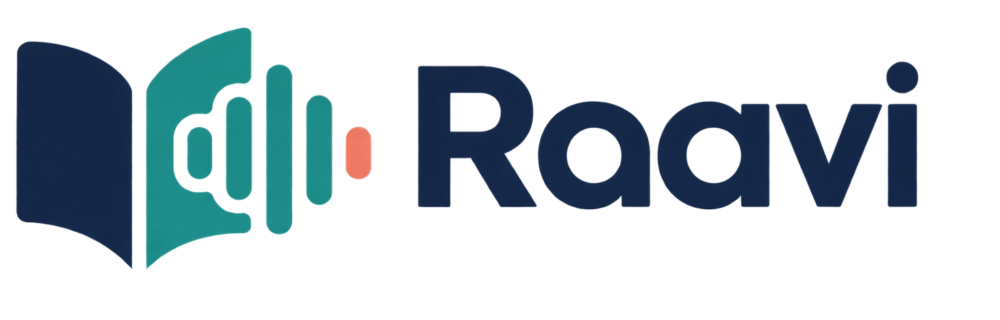
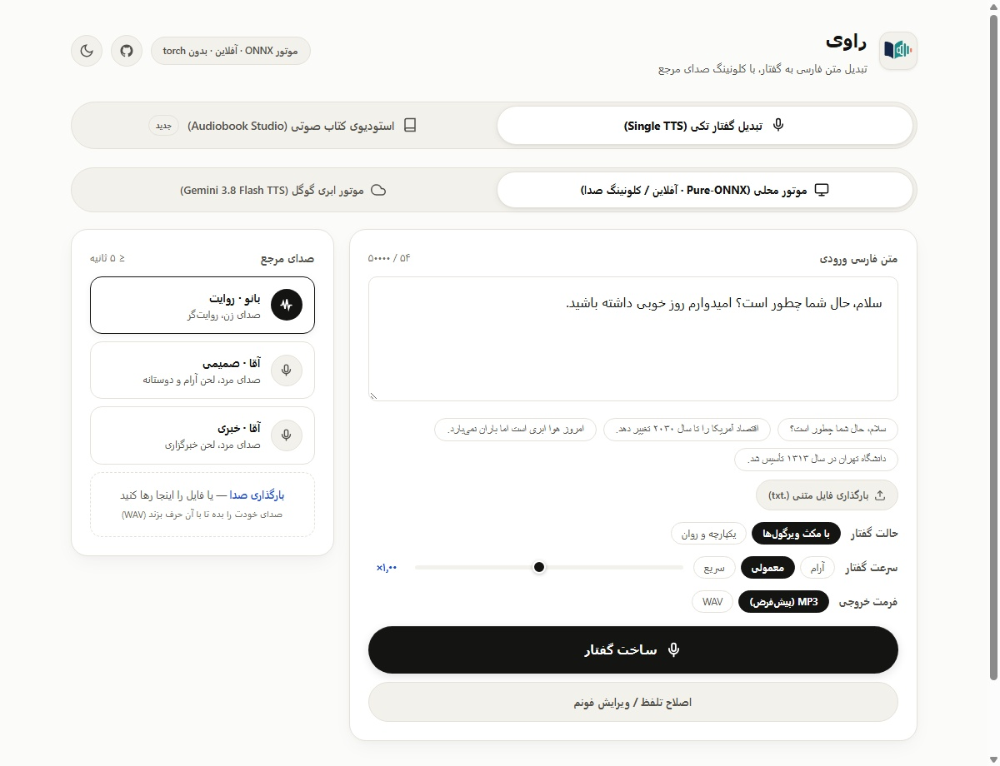
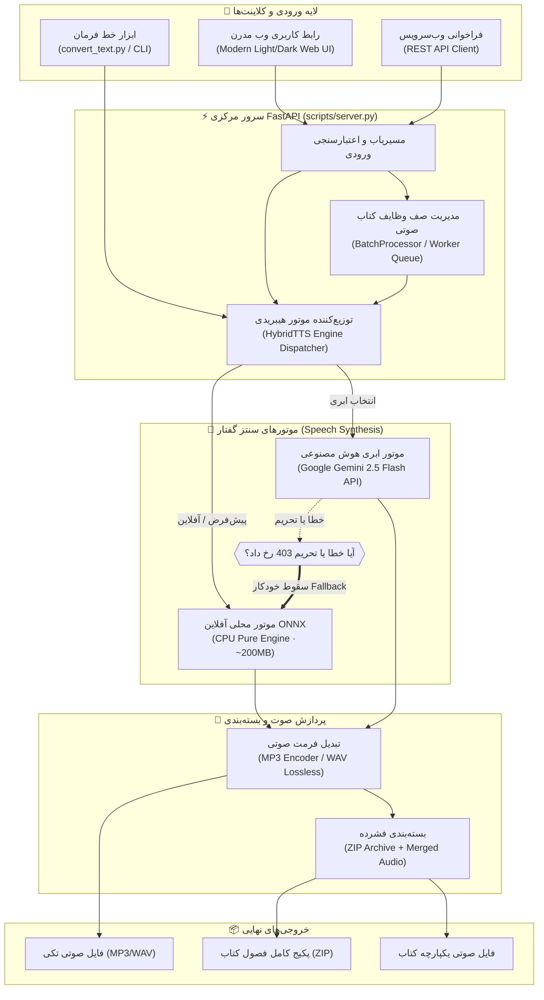
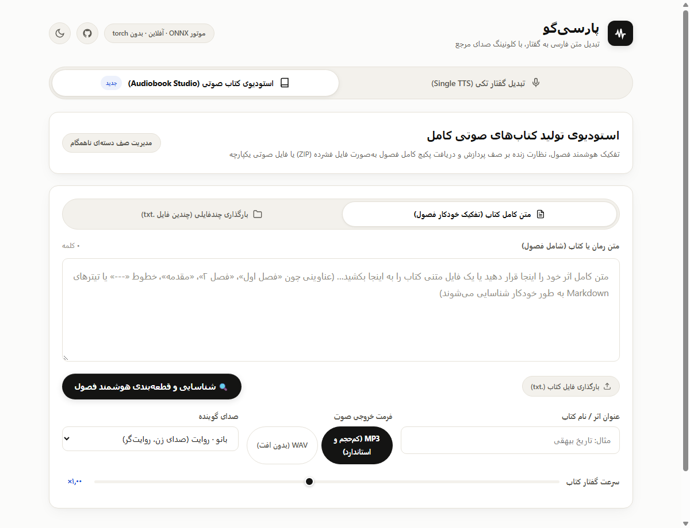

<div align="center">

<picture>
  <source media="(prefers-color-scheme: dark)" srcset="web/raavi-banner-dark.png">
  
</picture>

# راوی (Raavi)
### استودیوی پیشرفته تبدیل متن و کتاب صوتی فارسی با کلونینگ صدا

[](https://github.com/hamid-morsali-786/raavi-tts/stargazers)
[](https://github.com/hamid-morsali-786/raavi-tts/network/members)
[](LICENSE)
[](https://python.org)
[](https://github.com/hamid-morsali-786/raavi-tts/actions)
[](Dockerfile)
[](CONTRIBUTING.md)

<p align="center">
  <b>توسعه و بهینه‌سازی توسط:</b> <a href="https://github.com/hamid-morsali-786">hamid-morsali-786</a> · 
  <b>انشعاب‌یافته از:</b> <a href="https://github.com/nimaone/persian_tts">nimaone/persian_tts</a>
</p>

**فارسی** | [English](README.en.md)

<br/>

<p align="center">
  
</p>

</div>

---

## 📖 فهرست مطالب (Table of Contents)

- [معرفی و نمای کلی](#-معرفی-و-نمای-کلی-overview)
- [ویژگی‌های کلیدی (Key Features)](#-ویژگیهای-کلیدی-key-features)
- [معماری سیستم و جریان داده (Architecture)](#-معماری-سیستم-و-جریان-داده-architecture)
- [شروع سریع (Quick Start)](#-شروع-سریع-quick-start)
  - [۱. اجرای سریع در ویندوز (۱-کلیک)](#۱-اجرای-سریع-در-ویندوز-پیشنهادی)
  - [۲. اجرای ابری / کانتینری با داکر (Docker)](#۲-اجرای-مستقل-با-داکر-docker--docker-compose)
  - [۳. راه‌اندازی دستی پایتون](#۳-راه‌اندازی-دستی-مسیر-سبک-onnx)
- [استودیوی کتاب صوتی و صف پردازش (Audiobook Studio)](#-استودیوی-کتاب-صوتی-و-صف-پردازش-audiobook-studio)
- [موتور چندگانه هیبریدی و جمینای (Hybrid & Gemini API)](#-موتور-چندگانه-هیبریدی-و-راهنمای-gemini-tts-api)
- [ابزار خط فرمان (CLI Tool)](#-ابزار-خط-فرمان-cli-usage)
- [مستندات کامل API (REST Endpoints)](#-مستندات-کامل-api-rest-endpoints)
- [بنچمارک و مقایسه عملکرد](#-بنچمارک-و-مقایسه-عملکرد)
- [مشارکت در توسعه (Contributing)](#-مشارکت-در-توسعه-contributing)
- [اعتبارها، استناد و مجوزها](#-اعتبارها-استناد-و-مجوزها-credits--license)
- [تاریخچه ستاره‌ها (Star History)](#-تاریخچه-ستارهها-star-history)

---

## 🎯 معرفی و نمای کلی (Overview)

**راوی (Raavi)** پیشرفته‌ترین اکوسیستم متن‌باز سنتز گفتار فارسی (Text-to-Speech) با قابلیت **کلونینگ صدا (Voice Cloning)**، تبدیل متون حجیم و تولید کتاب صوتی است. این پروژه به صورت ۱۰۰٪ آفلاین روی **CPU** (بدون نیاز به کارت گرافیک GPU و بدون مصرف اینترنت) اجرا شده و خروجی صوتی با کیفیت بالا در فرمت‌های **MP3** و **WAV** با نرخ نمونه ۲۴ کیلوهرتز تولید می‌کند.

علاوه بر موتور آفلاین ONNX، راوی به یک موتور ابری هوشمند **Google Gemini Cloud TTS** با مکانیزم Fallback خودکار و صفر-قطعی مجهز است تا تعادلی بی‌نظیر میان سرعت آفلاین و کیفیت فوق‌طبیعی ارائه دهد.

---

## ✨ ویژگی‌های کلیدی (Key Features)

| قابلیت | شرح فنی | مزیت |
|---|---|---|
| 📚 **استودیو کتاب صوتی** | تفکیک هوشمند فصول بر مبنای عناوین، پردازش دسته‌ای و صف ناهمگام | تبدیل آسان کل کتاب متنی به صوت در یک مرحله |
| 🚀 **موتور دوگانه هیبریدی** | ترکیب موتور محلی خالص ONNX و موتور ابری Gemini 2.5 Flash | عملکرد پایدار آفلاین با امکان استفاده از هوش ابری |
| 🛡️ **مکانیزم Fallback خودکار** | سوئیچ خودکار به موتور محلی در شرایط اختلال شبکه یا خطای تحریم 403 | قطع نشدن فرآیند تولید حتی در شرایط تحریم |
| 🎧 **خروجی چندفرمت (MP3/WAV)** | خروجی فشرده MP3 با اینکودر استاندارد یا WAV بدون افت (Lossless) | حجم کم و سازگاری بالا برای وب و پادکست |
| 🎨 **طراحی مینیمال آوانگارد** | تم روشن مدرن (پیش‌فرض) و تم تیره لوکس با جابجایی هوشمند | تجربه کاربری چشم‌نواز و استاندارد WCAG |
| 💻 **ابزار اختصاصی CLI** | دستور `convert_text.py` با قابلیت پیش‌نمایش و پخش فوری (`--play`) | خودکارسازی خط فرمان و خط لوله‌های پردازش متن |
| ⚡ **راه‌اندازی ۱-کلیکه** | فایل‌های آماده `run_web_ui.bat` و `push_to_github.bat` در ویندوز | شروع به کار فوری بدون نیاز به تایپ دستورات پیچیده |
| 🐳 **کانتینر داکر آماده** | پشتیبانی کامل از `Dockerfile` و `docker-compose.yml` | استقرار فوری در سرورهای ابری و لینوکس |

---

## 🏗️ معماری سیستم و جریان داده (Architecture)

نمودار زیر نحوه تعامل اجزای نرم‌افزار، هدایت درخواست‌ها و لایه‌های پردازش صوت را نشان می‌دهد:



---

## 🚀 شروع سریع (Quick Start)

### ۱. اجرای سریع در ویندوز (پیشنهادی)

```powershell
git clone https://github.com/hamid-morsali-786/raavi-tts.git
cd raavi-tts
```

کافی است روی فایل **`run_web_ui.bat`** دابل‌کلیک کنید تا سرور به طور خودکار اجرا شده و مرورگر در آدرس `http://127.0.0.1:8000` باز شود.

---

### ۲. اجرای مستقل با داکر (Docker & Docker Compose)

برای استقرار روی لینوکس، مک یا سرورهای ابری بدون نیاز به تنظیم دستی پایتون:

```bash
# اجرای فوری در پس‌زمینه
docker compose up -d

# مشاهده لاگ‌ها
docker compose logs -f
```

سپس آدرس `http://localhost:8000` را در مرورگر خود باز کنید.

---

### ۳. راه‌اندازی دستی مسیر سبک ONNX

**مرحله ۱: ایجاد محیط مجازی و نصب وابستگی‌ها (~۲۰۰MB):**
```bash
python -m venv env
# در ویندوز:
.\env\Scripts\pip install onnxruntime numpy scipy soundfile sentencepiece fastapi uvicorn google-genai pedalboard typer
# در لینوکس:
./env/bin/pip install onnxruntime numpy scipy soundfile sentencepiece fastapi uvicorn google-genai pedalboard typer
```

**مرحله ۲: دریافت پکیج مدل‌ها از HuggingFace:**
```bash
pip install -U "huggingface_hub[cli]"
hf download Nimaone/pocket-tts-farsi-v2-onnx --local-dir model/onnx
```

**مرحله ۳: اجرای سرور:**
```bash
python scripts/server.py
```

---

## 📚 استودیوی کتاب صوتی و صف پردازش (Audiobook Studio)

استودیوی کتاب صوتی راوی برای تولید آسان کتاب‌های صوتی کامل طراحی شده است:

<p align="center">
  
</p>

### قابلیت‌های استودیو:
1. **تفکیک هوشمند فصول:** تشخیص خودکار سرفصل‌ها و پارتیشن‌های متنی بدون نیاز به تقطیع دستی.
2. **صف پردازش پس‌زمینه (Async Queue):** پردازش وظایف حجیم در پس‌زمینه بدون قفل شدن صفحه مرورگر.
3. **پیشرفت بلادرنگ:** گزارش درصد انجام و تخمین زمان باقی‌مانده.
4. **خروجی تجمیعی:** دانلود کل فصول در قالب **فایل فشرده ZIP** همراه شناسنامه کتاب (Metadata) یا یک **فایل صوتی یکپارچه (Merged Audio)**.

---

## 🤖 موتور چندگانه هیبریدی و راهنمای Gemini TTS API

<p align="center">
  
</p>

### مزیت هوش مصنوعی Gemini 2.5 Flash:
- بیان روان، درک لحن احساسی و آهنگ کلام کاملاً انسانی.
- تلفظ فوق‌العاده دقیق عبارات پیچیده، اسامی خاص و متون ادبی فارسی.

### نحوه فعال‌سازی کلید API:
1. یک کلید API رایگان از کنسول رسمی [Google AI Studio](https://aistudio.google.com/app/apikey) دریافت کنید.
2. کلید را در فایل `.env` در ریشه پروژه قرار دهید:
   ```env
   GEMINI_API_KEY=AIzaSyYourActualApiKeyHere
   ```
3. یا در ترمینال تنظیم کنید:
   ```powershell
   $env:GEMINI_API_KEY="AIzaSyYourActualApiKeyHere"
   ```

### سپر تاب‌آوری در برابر تحریم‌ها (Automatic Resilience):
در صورتی که به دلیل اعمال محدودیت‌های جغرافیایی گوگل با خطای `PERMISSION_DENIED 403` مواجه شوید یا اینترنت شما قطع شود، سیستم **به صورت هوشمند و بدون اختلال به موتور محلی آفلاین ONNX سوئیچ می‌کند**.

---

## 💻 ابزار خط فرمان (CLI Usage)

### تبدیل مستقیم فایل متنی با پخش فوری:
```bash
# تبدیل متن طولانی با صدای دلخواه و پخش فوری پس از اتمام
python scripts/convert_text.py book_chapter.txt --voice voices/female_narration.wav --format mp3 --play
```

### تبدیل جمله در خط فرمان:
```bash
python scripts/tts_onnx.py "سلام دنیا، روز شما بخیر" voices/male_hello.wav output/out.wav --pack
```

---

## 📡 مستندات کامل API (REST Endpoints)

| روش | آدرس Endpoint | ورودی داده (Payload) | خروجی (Response) |
|---|---|---|---|
| `GET` | `/` | — | وب اپلیکیشن (`web/index.html`) |
| `GET` | `/api/voices` | — | لیست صداها `{voices: [...]}` |
| `POST` | `/api/tts` | `{text, voice, pace?, mode?, engine?, audio_format?}` | شناسنامه صوت `{id, phonemes, duration, format}` |
| `GET` | `/api/audio/{id}` | پارامتر اختیاری `?format=mp3` یا `?format=wav` | استریم فایل صوتی (`audio/mpeg` یا `audio/wav`) |
| `POST` | `/api/phonemize` | `{text, mode?}` | رشته فونم‌ها `{phonemes}` |
| `POST` | `/api/tts-phonemes` | `{phonemes, voice, pace?, engine?, audio_format?}` | سنتز مستقیم از فونم |
| `POST` | `/api/voice/upload` | فایل صوتی کاربر (`multipart/form-data`) | مشخصات صدای بارگذاری‌شده `{id, name, seconds}` |
| `POST` | `/api/batch/audiobook` | `{title, text, voice, pace?, mode?, engine?, audio_format?}` | شروع پردازش صف `{task_id, status, chapters}` |
| `GET` | `/api/batch/status/{id}` | — | درصد پیشرفت و وضعیت `{progress, status, chapters}` |
| `GET` | `/api/batch/download/{id}` | پارامتر `?format=zip` یا `?format=merged` | فایل دانلود ZIP یا Merged صوتی |

---

## 📊 بنچمارک و مقایسه عملکرد

| ویژگی | موتور ONNX خالص (راوی) | موتور مرجع PyTorch | سرویس‌های خارجی صرف |
|---|---|---|---|
| **نیازمندی سخت‌افزاری** | **فقط CPU** (بدون نیاز به کارت گرافیک) | CPU یا GPU | سرور ابری |
| **حجم وابستگی‌ها** | **~۲۰۰ مگابایت** | ~۱٫۲ گیگابایت | وابسته به پکیج |
| **وابستگی شبکه** | **۱۰۰٪ آفلاین و محلی** | ۱۰۰٪ آفلاین | نیازمند اینترنت دائم |
| **سرعت پردازش (۲٫۸s صدا)** | **۳۲۸۰ میلی‌ثانیه** روی CPU معمولی | ۳۴۲۰ میلی‌ثانیه | وابسته به پینگ اینترنت |
| **خروجی فرمت‌ها** | **MP3 + WAV** | فقط WAV خام | فرمت‌های مختلف |
| **استودیو کتاب صوتی** | **دارد (صف خودکار + ZIP)** | ندارد | محدود به هزینه اشتراک |

---

## 🤝 مشارکت در توسعه (Contributing)

ما از هرگونه مشارکت، گزارش باگ و ارسال ویژگی‌های جدید استقبال می‌کنیم!
برای اطلاع از نحوه راه‌اندازی محیط توسعه، استانداردهای کدنویسی و ارسال Pull Request، لطفاً فایل [CONTRIBUTING.md](CONTRIBUTING.md) و [CODE_OF_CONDUCT.md](CODE_OF_CONDUCT.md) را مطالعه فرمایید.

---

## 📜 اعتبارها، استناد و مجوزها (Credits & License)

- کد این مخزن تحت مجوز **[MIT License](LICENSE)** به صورت آزاد و متن‌باز منتشر شده است.
- این پروژه توسط [حمید مرسلی (hamid-morsali-786)](https://github.com/hamid-morsali-786) بر پایه‌ی مخزن ارزشمند [nimaone/raavi-tts](https://github.com/nimaone/raavi-tts) بازطراحی و با استودیوی کتاب صوتی، صف وظایف، موتور هیبریدی و تم نوین گسترش یافته است.
- **مدل سنتز گفتار پایه:** برگرفته از [`mehdi-hf/pocket-tts-farsi-v2`](https://huggingface.co/mehdi-hf/pocket-tts-farsi-v2) کاری از مهدی ملاحیاری ([`mallahyari/pocket-tts`](https://github.com/mallahyari/pocket-tts)) با مجوز **CC-BY-NC-4.0**.
- **مدل تبدیل متن به فونم (G2P):** مدل [`Homo-GE2PE-Persian`](https://huggingface.co/MahtaFetrat/Homo-GE2PE-Persian) توسعه‌یافته توسط سرکار خانم الناز رحمتی و همکاران.
- **معماری پایه:** کتابخانه [`pocket-tts`](https://pypi.org/project/pocket-tts/) کاری از [Kyutai](https://kyutai.org).

> **توجه مجوز تجاری:** با توجه به مجوز غیرتجاری مدل آکوستیک پایه (**CC-BY-NC-4.0**)، استفاده تجاری از خروجی‌های صدای تولیدشده با این مدل نیازمند اجازه پدیدآورندگان مدل پایه است.

---

## ⭐ تاریخچه ستاره‌ها (Star History)

اگر این پروژه برای شما مفید واقع شده است، لطفاً با ثبت یک ستاره (Star) در گیت‌هاب از توسعه آن حمایت کنید:

<p align="center">
  <a href="https://star-history.com/#hamid-morsali-786/raavi-tts&Date">
    
  </a>
</p>
