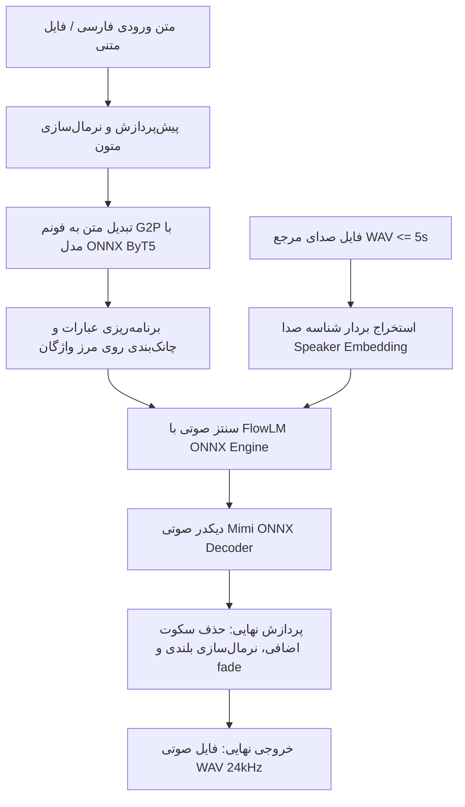

# سند طراحی فنی: راه‌اندازی و استفاده از تبدیل متن فارسی به گفتار (Persian TTS)

تاریخ: ۲۶ سپتامبر ۲۰۲۶  
وضعیت: پیش‌نویس نهایی جهت تایید کاربر  
مبتنی بر ریپازیتوری: [nimaone/persian_tts](https://github.com/nimaone/persian_tts)

---

## ۱. هدف و چشم‌انداز
ایجاد یک سامانه مستقل، سریع و کاملاً آفلاین تبدیل متن فارسی به گفتار (Text-to-Speech) با پشتیبانی از کلونینگ صدا (Voice Cloning) بر بستر پردازنده مرکزی (CPU) با استفاده از موتور بهینه‌شدهٔ ONNX و معماری `pocket-tts-farsi-v2`.

**قید کلیدی:** تمام پردازش‌ها روی همان لپ‌تاپی انجام می‌شود که کاربر با آن برنامه‌نویسی می‌کند. بنابراین استفاده از موتور ONNX و پرهیز از بارگذاری‌های سنگین، همراه با محدودسازی threadهای پردازشی (حداکثر ۲ ترد موازی)، تضمین می‌کند که سیستم روان بماند و تسک‌های برنامه‌نویسی کاربر با کندی مواجه نشوند.

این سامانه به سه شکل قابل استفاده خواهد بود:
1. **واسط خط فرمان (CLI):** اجرای سریع دستورات تکی و دریافت خروجی WAV.
2. **رابط کاربری وب (Web UI):** پنل گرافیکی با پخش آنلاین، شکل موج، تنظیم سرعت، ویرایش فونم‌ها و بارگذاری صدای دلخواه.
3. **اسکریپت و ماژول پایتون (`convert_text.py`):** خواندن متن از فایل‌های متنی یا رشته‌های ورودی طولانی و تولید قطعات صوتی.

---

## ۲. معماری سامانه و ساختار پوشه‌ها

```
f:\work_3\ptts/
├── env/                         # محیط مجازی ایزوله پایتون ۳.۱۲
├── model/
│   └── onnx/                    # بسته یکپارچه مدل‌های ONNX (~۴۷۰MB)
│       ├── flowlm_unified_kv.onnx
│       ├── mimi_decoder.onnx
│       ├── g2p_encoder.onnx
│       ├── g2p_decoder.onnx
│       ├── weights.npz
│       ├── decode_state_init.npz
│       └── manifest.json
├── voices/                      # فایل‌های صوتی مرجع (نمونه‌های پیش‌فرض + دلخواه)
│   ├── male_hello.wav           # صدای آقا صمیمی
│   ├── female_narration.wav     # صدای بانو روایت
│   └── male_news.wav            # صدای آقا خبری
├── output/                      # ذخیره فایل‌های صوتی تولیدشده
├── scripts/
│   ├── tts_onnx.py              # موتور اصلی و CLI تبدیل با ONNX
│   ├── g2p_onnx.py              # ماژول مستقل تبدیل نویسه به فونم
│   └── server.py                # سرور رابط وب بر پایه FastAPI
├── web/
│   └── index.html               # رابط کاربری وب واکنش‌گرا و راست‌چین
├── convert_text.py              # اسکریپت سفارشی برای تبدیل آسان فایل متنی یا متون بلند
└── requirements.txt             # فهرست وابستگی‌های سبک
```

---

## ۳. جریان داده و مولفه‌های پردازشی (Data Flow)



### اجزای کلیدی:
1. **نرمال‌سازی و پاک‌سازی:** تبدیل خودکار علائم نگارشی و یکسان‌سازی کاراکترهای فارسی/عربی.
2. **مدل G2P (Grapheme-to-Phoneme):** مدل سبک تبدیل کلمات به آواها (فونم) بدون نیاز به پردازش سنگین زبانی خارجی.
3. **موتور تولید گفتار FlowLM ONNX:** مدل بازگشتی با بهینه‌سازی کش K/V که کلمات را به صورت گام‌به‌گام به تنسورهای صوتی تبدیل می‌کند.
4. **دیکدر عصبی Mimi:** بازسازی موج پیوسته صوتی با فرکانس ۲۴,۰۰۰ هرتز.
5. **لایه‌های تضمین کیفیت خروجی:** فیلتر برش سکوت، تطبیق بلندی صدا و بازتولید با مقداردهی seed.

---

## ۴. رابط‌های کاربری و نحوه استفاده

### الف) استفاده از خط فرمان (CLI)
```bash
./env/Scripts/python.exe scripts/tts_onnx.py "سلام و درود، به سیستم تبدیل متن به گفتار خوش آمدید." voices/male_hello.wav output/welcome.wav --pack
```

### ب) اجرای پنل وب (Web GUI)
```bash
./env/Scripts/python.exe scripts/server.py
```
سپس باز کردن آدرس `http://127.0.0.1:8000` در مرورگر:
- امکان بارگذاری صدای مرجع شخصی (فرمت‌های WAV, MP3, OGG).
- امکان ویرایش دستی فونم در صورت نیاز به تغییر تلفظ خاص.
- پیش‌نمایش موج صوتی و دانلود با یک کلیک.

### ج) اسکریپت سفارشی برای متون طولانی (`convert_text.py`)
یک ابزار کمکی به پروژه افزوده می‌شود که:
- یک فایل متنی `.txt` یا متن چند پاراگرافی را دریافت کند.
- متن را به شکل هوشمند به جملات و عبارات با وقفه استاندارد بشکند.
- کل متن را پردازش کرده و فایل نهایی WAV یکپارچه تحویل دهد.

---

## ۵. مدیریت خطاها و پایداری (Error Handling & Edge Cases)
- **بررسی زمان صدای مرجع:** کنترل خودکار اینکه صدای ورودی بیش از ۵ ثانیه نباشد (در صورت طولانی‌تر بودن، به‌صورت خودکار تا ۵ ثانیه برش داده شود تا از خطای مدل جلوگیری شود).
- **مدیریت کاراکترهای ناشناخته و انگلیسی:** تبدیل یا گذشت هوشمند از کاراکترهایی که در دایره فونم فارسی تعریف نشده‌اند.
- **تلاش مجدد خودکار (Retry logic):** موتور ONNX ریپو مجهز به تست کیفیت داخلی است که در صورت بروز قطعی یا سکوت طولانی، تولید چانک را مجدداً تکرار می‌کند.
- **بررسی دانلود کامل مدل‌ها:** اعتبارسنجی هش و حجم فایل‌های مدل ONNX در پوشه `model/onnx/` قبل از استارت برای پیشگیری از خطاهای ناقص بودن دانلود.

---

## ۶. طرح تست و صحت‌سنجی (Verification Plan)
1. **تست محیطی:** بررسی صحت ایجاد venv با پایتون ۳.۱۲ و نصب کامل بدون خطای پکیج‌های `onnxruntime`, `soundfile`, `scipy`, `fastapi`.
2. **تست دانلود مدل:** اطمینان از وجود فایل‌های ضروری ONNX در مسیر `model/onnx/` (به‌ویژه فایل‌های `.onnx` و `.npz`).
3. **تست واحد سنتز صوت (CLI Test):** تولید یک فایل تست با متن «سلام، این یک آزمایش تبدیل متن به صوت است.» و بررسی وجود فایل خروجی WAV و مدت زمان معتبر آن.
4. **تست کار با صدای مرجع دلخواه:** تست کلونینگ با فایل صوتی مرجع و اعتبارسنجی ۲۴kHz بودن خروجی.
5. **تست سلامت سرور وب:** ارسال درخواست تست به API سرور و بررسی بالا آمدن وب‌اپلیکیشن.
